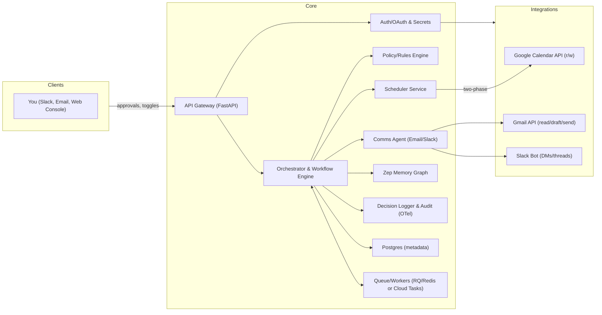

# TRD — AI Executive Assistant (Calendar & Coordination)

## 0) Executive Summary

We’re building a policy-driven “calendar owner” that (a) detects scheduling/reschedule needs, (b) drafts and—when safe—sends messages over Gmail/Slack, (c) commits calendar changes with two-phase safety checks, and (d) learns durable preferences via Zep memory graphs. MVP runs strictly approval-first; the confidence scorer runs in shadow (logging would-have-decided verdicts) and auto-send for 1-1s is enabled in rollout Phase 2 once thresholds are calibrated.

**Integration architecture (decided 2026-06-10, PRD §7): hybrid.** An LLM agent (Claude Agent SDK) drives parsing, drafting, and coordination via MCP tools — mature MCP servers for Calendar, Gmail, and Slack replace hand-built API clients for reads and comms. Calendar **writes** remain exclusive to the deterministic Scheduler service (§2.3) so two-phase commit, idempotency, and policy enforcement live in plain code, not prompts.

---

## 1) System Architecture



**Deployment**: Vercel serverless (FastAPI in `/api`) for stateless APIs + a lightweight worker tier (e.g., Cloud Run/Render/Railway) for long-running jobs. Redis for locks/queues. Postgres for durable state. OpenTelemetry for traces; structured logs to a sink (e.g., Datadog/Logfire).

---

## 2) Major Components

### 2.1 Orchestrator & Workflow Engine

* Receives triggers (conflicts, inbound requests, holds expiring).
* Assembles **Context Block**: Scheduler policy + **Zep** memory (basic or summarized) + last 4–6 thread messages + task objective.
* Decides path: **Approval** vs **Auto** using confidence scoring (Section 6).

### 2.2 Policy / Rules Engine

* Declarative YAML/JSON policies versioned in Postgres:

  * Priority tiers, reschedule windows (±14d for 1-1s), buffers, work hours per attendee, no-meeting days, VIP rules, legal/HR strict mode.
* Evaluated deterministically before any action. Feature-flaggable per audience (directs vs execs vs customers).

### 2.3 Scheduler Service

* **Two-phase commit**:

  1. **Dry-Run:** simulate on GCal (free/busy, recurrence integrity, resource/room capacity, overlap, DST/TZ/holiday checks).
  2. **Commit:** write event(s) with idempotency key; re-validate.
* **Series cadence keeper**: when moving a 1-1, preserves day/time bias, repairs recurrences.
* **Soft holds** with TTL (auto-expire/auto-clean).

### 2.4 Comms Agent

* **Email** (Gmail): draft/send, label “ai-assistant”, thread-aware subject normalization.
* **Slack**: DM + thread replies; uses message shortcuts; escalates to email if no response in N hours.
* **Templates**: tone by counterpart (exec-concise vs friendly-internal), includes minimal agenda, links.
* Implemented as an LLM agent with Gmail/Slack MCP tools; it can draft and converse but cannot write to the calendar — commits go only through the Scheduler service. External messages carry the assistant disclosure signature (PRD R7).

### 2.5 Memory (Zep)

* Stores durable preferences, org facts, meeting series, and evidence snippets.
* Retrieval modes:

  * **Fast path** (Slack): `basic` Context Block + last few messages.
  * **Precise path** (email/complex reschedules): query graph for MeetingSeries + Preference edges, build **custom** Context Block trimmed for scheduling.
* Write-backs after actions (e.g., learned “Tue/Thu AM” preference).

### 2.6 Decision Logger & Audit

* Every action: inputs → policy snapshot → memory snapshot checksum → model outputs → human approvals → effects.
* Exposed in a web console; exportable for SOC.

---

## 3) External Integrations & Scopes

### 3.1 Google OAuth

* **Calendar**: `.../auth/calendar`, `.../auth/calendar.events`
* **Gmail**: `.../auth/gmail.modify`, `.../auth/gmail.send` (read minimal; label all assistant traffic)
* Store refresh tokens encrypted (KMS); rotate; least privilege per feature flag.

### 3.2 Slack Bot

* Scopes: `chat:write`, `im:write`, `channels:read`, `groups:read`, `users:read`, `users.profile:read`
* Events: app_mention, message.im, message.channels, reaction_added (for quick approvals).

### 3.3 Future (feature-flagged)

* **ATS (Greenhouse)** for interview panels
* **Salesforce** for customer urgency

---

## 4) Data Model (Pydantic sketches)

```python
# Core entities
class Person(BaseModel):
    person_id: UUID
    email: EmailStr
    display_name: str
    timezone: str

class MeetingSeries(BaseModel):
    series_id: UUID
    title: str
    counterpart_ids: list[UUID]
    default_duration_min: int
    cadence_rule: str  # iCal RRULE
    policy_id: UUID

class Policy(BaseModel):
    policy_id: UUID
    tier: Literal["VIP","Customer","Hiring","Internal","1-1"]
    reschedule_window_days: int
    buffer_before_min: int
    buffer_after_min: int
    working_hours: dict[str, tuple[str,str]] # tz -> (start,end)
    strict_mode: bool = False

class ScheduleIntent(BaseModel):
    intent_id: UUID
    kind: Literal["new","reschedule","cancel","hold"]
    target_series_id: UUID | None
    attendees: list[EmailStr]
    duration_min: int
    window_candidates: list[tuple[datetime, datetime]]
    source: Literal["slack","email","conflict_detector"]

class Decision(BaseModel):
    decision_id: UUID
    intent_id: UUID
    confidence: float
    autonomy: Literal["approve_first","auto_send","block"]
    rationale: str
    policy_snapshot_hash: str
    memory_snapshot_hash: str
```

**Relational tables**: `persons`, `meeting_series`, `policies`, `schedule_intents`, `decisions`, `events`, `audit_logs`.

---

## 5) Zep Memory Ontology & Flows

### 5.1 Entities & Edges

* **Entities**: `Person`, `Team`, `MeetingSeries`, `Preference` (TimeWindow, Channel, Tone), `Policy`, `Travel`, `Holiday`.
* **Edges**: `reports_to`, `member_of`, `has_series`, `prefers_slot`, `communicates_on`, `tone_pref`, `reschedule_rule`, `timezone_of`, `on_pto_on`, `blackout`.

Each `Preference` carries validity windows (`valid_from`, `valid_to`) and evidence pointers (email/slack/thread ids).

### 5.2 Read Paths

* **Fast (Slack)**: `thread.get_user_context(mode="basic")` → append last 4–6 human messages.
* **Precise (Email/Complex)**: graph query filtered to `{MeetingSeries, Preference, Travel, Holiday}` nodes touching you + counterpart; BFS biased to last N “episodes”; generate **custom Context Block** (token-bounded).

### 5.3 Write Paths

* After successful reschedule/booking:

  * Upsert `Preference(TimeWindow)` if user chose/accepted a consistent slot.
  * Upsert `Channel`/`Tone` if counterpart consistently responds on a channel first.
  * Insert transient `Travel` (auto-expires).

**Privacy**: Only store minimal structured facts; redact raw content from emails/Slack; keep evidence as hashed references.

---

## 6) Autonomy & Confidence

### 6.1 Features

* Policy tier (VIP/legal → low autonomy)
* Attendee count/group size
* Is series? (1-1 yes vs ad-hoc)
* TZ spread & DST proximity
* Historical acceptance rate for counterpart
* Memory strength (freshness, #evidence)
* Message ambiguity score (LLM heuristic)

### 6.2 Thresholds (initial)

* **Auto-send** if: confidence ≥ 0.85 AND tier ∈ {1-1, Internal} AND attendees ≤ 2 AND no DST/holiday hit.
* **Approve-first** if: 0.55 ≤ confidence < 0.85 OR hiring/customer/internal-xfunc with ≥3 attendees.
* **Block** if: confidence < 0.55 OR VIP/legal/HR.

Explainability: include top 5 feature attributions in the approval card.

**MVP note (2026-06-10):** during MVP, every action routes to approval regardless of score; the scorer logs its would-have-decided verdict (shadow mode). The thresholds above take effect in rollout Phase 2 after calibration against shadow logs (PRD §12).

---

## 7) Safety Rails

1. **Two-phase commit** with idempotency keys on event writes.
2. **Sanity sweeps (nightly)**: broken Meet links, overlaps, orphaned recurrences, expired holds → auto-fix or queue for approval.
3. **Recipient disambiguation**: org graph + alias expansion; prompt on first-time contacts.
4. **TZ/Holiday guardrails**: per-attendee local hours; block outside unless policy allows.
5. **Undo**: single-click rollback (stores pre-state snapshot for N days).
6. **Prompt-injection defense**: inbound email/Slack content is untrusted data, never instructions. The comms agent’s tool access is scoped per intent; counterpart content cannot modify policies, recipients, or autonomy level. First-time/unrecognized senders get lowest autonomy (PRD R7).

---

## 8) APIs (FastAPI)

### 8.1 Internal

* `POST /intents` — declare new scheduling/reschedule intent (from parser or user command).
* `POST /decisions/{id}/approve` — approve a pending action.
* `POST /decisions/{id}/reject` — reject; auto-propose alternatives.
* `GET /agenda/digest?when=YYYY-MM-DD` — morning brief payload.
* `POST /hooks/gmail` — inbound email/webhook envelope (thread id, participants).
* `POST /hooks/slack` — slash commands, message actions.
* `POST /hooks/gcal` — event change notifications.

### 8.2 Zep Integration Utilities

* `POST /memory/upsert` — wrap Zep upsert for `Preference/Travel`.
* `GET /memory/context?mode=basic|summarized|custom&series_id=...`

All endpoints require JWT (user) or signed bot tokens; internal services via mTLS.

---

## 9) Ingestion & Parsers

* **Email parser**: detect meeting asks (time phrases, durations, attendees, purpose), extract constraints. Thread-aware.
* **Slack parser**: slash commands (`/findtime 30m this week Alex`), DM heuristics.
* **Conflict detector**: listens to GCal push notifications; promotes conflicts to `ScheduleIntent`.

---

## 10) Observability

* **Tracing**: Orchestrator spans; tags: `person_id`, `intent_id`, `series_id`.
* **Metrics**: automation rate, time-to-book, error rate, sweep repairs, counterpart SLA.
* **Logging**: decision log with hashes of policy/memory snapshots (no PII).

---

## 11) Security & Privacy

* Data minimization (store structured facts, not raw content).
* Encryption at rest (Postgres/Redis/KMS), in transit (TLS).
* OAuth storage isolation; per-environment secrets.
* **Data retention**: memory facts auto-expire based on `valid_to`; audit logs retained 90 days (configurable).
* Role-based toggles: only you (and optional Chief of Staff) can flip autonomy per tier.

---

## 12) Performance Targets

* Slack interactive actions: P95 < 1.0s round-trip (use `basic` memory path).
* Email drafts: P95 < 3.0s (allow summarized/custom memory).
* Propose-times latency: initial options in ≤ 60s from trigger.
* Sanity sweep: completes nightly in < 10 min for your calendar scale.

---

## 13) Rollout & Flags

* **Phase 0 (Shadow, you only)**: 2 weeks, no sends/writes; drafts + shadow-scored verdicts; KPI baseline (PRD §12).
* **Phase 1 (You)**: approval-first for 1-1s; soft holds; morning digest.
* **Phase 2 (Directs)**: enable auto-send for 1-1s; cadence keeper.
* **Phase 3 (Peers/Execs/Hiring)**: enable backfill/waitlist; ATS/CRM presets (flags off by default).

Feature flags:

* `auto_reschedule_1_1`
* `soft_holds`
* `waitlist_backfill`
* `travel_mode`
* `series_cadence_keeper`
* `sanity_sweeps`

---

## 14) Test Plan (MVP)

**Unit**

* Policy evaluation, tz/holiday math, DST edges, recurrence repair.

**Integration**

* Gmail thread → intent → decision → draft → approval → event commit → audit log with memory write-back.

**Sandbox scenarios**

* VIP conflict blocks auto-send.
* Travel shifts working hours (from Zep).
* Soft hold expires → cleaned.

**Canary**

* 2 weeks “shadow mode” (no sends; only drafts + suggested actions) to calibrate confidence thresholds — this is rollout Phase 0 in PRD §12.

---

## 15) Implementation Approach

**Development Strategy**: We follow a 35-step incremental implementation plan (see `../plan.md`) with **CI/CD infrastructure prioritized early** (Steps 4-8) to ensure:
- Automated testing on every commit
- Code quality gates from day one
- TDD-friendly development workflow
- Production-ready practices from the start

**Build Order** (aligned with plan.md phases):

**Phase 1: Foundation & CI/CD** (Steps 1-10)
1. Project initialization + FastAPI + Settings
2. **Complete CI/CD pipeline** (GitHub Actions, testing, quality checks, Docker, deployment)
3. Database setup + Error handling

**Phase 2: Database & Models** (Steps 11-17)
4. SQLModel + Migrations + Repository pattern
5. Feature flags + Policy engine

**Phase 3: Authentication & Security** (Steps 18-20)
6. OAuth models + Token storage + JWT middleware

**Phase 4: Calendar Core** (Steps 21-25)
7. Google OAuth + calendar reads via MCP + availability service
8. Scheduler write service (two-phase commit) + conflict detection

**Phase 5: Agent & Communication** (Steps 26-32)
9. Agent foundation (Claude Agent SDK) + Gmail/Slack via MCP
10. Structured-output extraction + approval cards + drafting + Zep memory

**Phase 6: Orchestration** (Steps 33-35)
11. Slot finder + approval workflow/decision logger/shadow scorer + orchestrator with shadow mode

> **Revised 2026-06-10:** plan.md was renumbered to the reorganized scheme and Steps 21–35 rewritten for the hybrid agent+MCP architecture (§0, PRD §7): MCP servers replace hand-built clients for reads/comms, parsing/drafting become agent structured output, calendar writes get an explicit two-phase-commit Scheduler step, and Zep memory lands in MVP as Step 32.

**Phase 7: Advanced Features** (Post-MVP)
12. Confidence auto-send enablement (scorer ships in MVP, shadow-only)
13. Travel mode + Sanity sweeps

---

## 16) Open Technical Choices (defaults in parentheses)

* Queue: (Redis RQ) vs Cloud Tasks
* Worker host: (Cloud Run) vs Render
* ORM: (SQLModel) with Alembic
* TZ lib: (dateutil + pytz)
* Test env: (Playwright) for Slack interactivity mocks

---

## 17) Example Flows

### 17.1 Reschedule 1-1 (Auto-send path)

1. CEO hold arrives → conflict detected → `ScheduleIntent(reschedule)`.
2. Fetch **custom** Context Block (series prefs; counterpart core hours).
3. Policy says 1-1 movable ±14d, maintain afternoon bias.
4. Sched proposes two options; confidence 0.88 → **auto-send** email.
5. Reply “Option 2” parsed → commit event → write-back Preference(TimeWindow).
6. Audit entry with policy/memory hashes; Slack DM summary to you.

### 17.2 New internal meeting via Slack (Approval path)

`/findtime 45m this week @Alex purpose:"Q3 retro"`
→ Fast path memory → 2 options in UI → you tap Approve → calendar commit.
